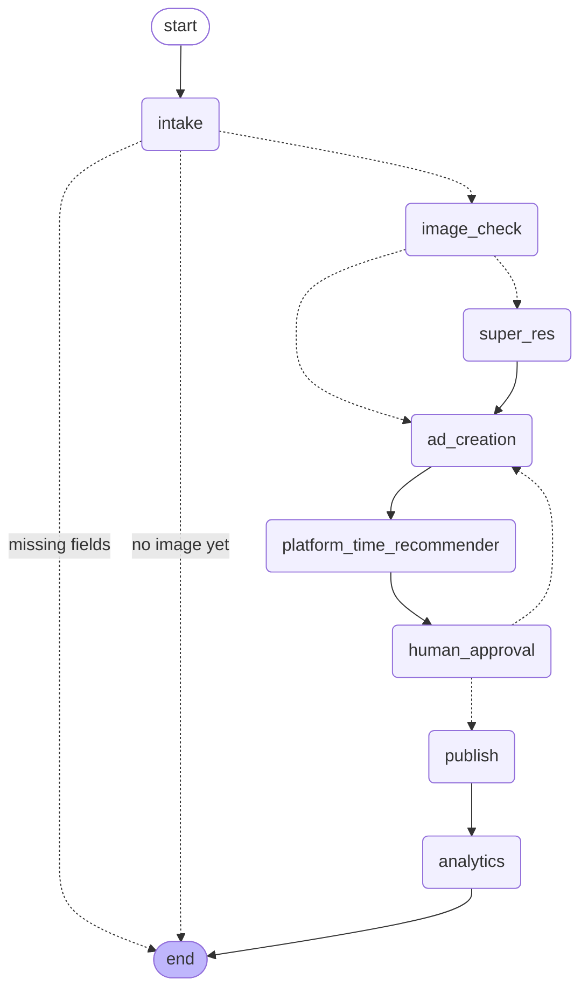
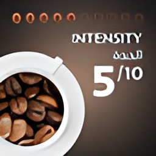
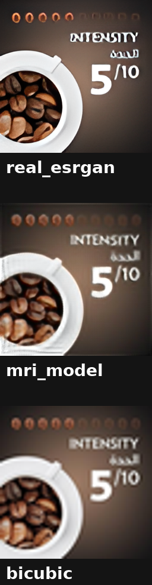

# Agentic Marketing Assistant

An AI Marketing Assistant that takes a marketing manager from a rough campaign idea
all the way to an approved, scheduled social-media post. It has a conversation to
understand the brief, enhances the product photo with a super-resolution model,
generates an ad image and caption, recommends a platform and publish time, gates
everything on the manager's explicit approval, "publishes" the post, and reports
on its performance.

Everything below — framework, tools, workflow, the super-resolution comparison,
a full example run, and what's simulated versus real — is documented in this one
file, so reading it should be enough to understand and run the whole project.

---

## Installing Ollama

The assistant's reasoning (intake extraction, captions, platform rationale,
performance recommendations) is powered by **Qwen3.5:9b** served locally through
[Ollama](https://ollama.com). Every LLM-backed tool has a deterministic fallback,
so the app runs end-to-end even without Ollama — but responses are noticeably
better with the real model.

**Linux / macOS:**
```bash
curl -fsSL https://ollama.com/install.sh | sh
```

**Windows:** download the installer from [ollama.com/download](https://ollama.com/download).

Then pull the model and start the server:
```bash
ollama pull qwen3.5:9b
ollama serve
```

By default Ollama listens on `http://localhost:11434`. This project talks to
Ollama through a single hardcoded constant, `OLLAMA_HOST` in
`tools/llm_client.py` — leave it as-is if Ollama runs on the same machine;
if it's on another machine on your network (e.g. because your LLM and your
SR model run on separate GPUs), point it at that machine's address instead.

---

## Installing and running the project

```bash
# 1. Clone and enter the project
git clone https://github.com/A190nux/marketing_agent
cd marketing_agent

# 2. Install dependencies
pip install -r requirements.txt

# 3. (Optional) drop in super-resolution weights -- see checkpoints/README.md
#    - checkpoints/RealESRGAN_x4plus.pth
#    - checkpoints/best_sr_model.pt

# 4. Launch the app
streamlit run app.py
```

Open the URL Streamlit prints (default `http://localhost:8501`).

**The app runs fully without Ollama or SR weights present.** Every LLM-backed
tool falls back to a deterministic template, and both super-resolution
backends fall back to a Lanczos upscale, so the entire workflow — intake,
image enhancement, ad creation, approval gate, publish, analytics — is
testable with zero external dependencies running. Quality is better across
the board with the real model and real weights in place.

**Python 3.11** is recommended. `basicsr`/`realesrgan` (the Real-ESRGAN
dependency) lag behind on newer Python support, so 3.11 is the safe middle
ground — modern enough for current `torch`/`torchvision` wheels, old enough
that `basicsr` won't fight you. 3.10–3.12 should also work; avoid 3.13+.

**One dependency landmine, handled automatically:** `basicsr` imports
`torchvision.transforms.functional_tensor`, which was removed in
`torchvision>=0.17` — this used to break `import realesrgan` outright with
a `ModuleNotFoundError` on any reasonably current install. `tools/super_resolution.py`
now patches this transparently at import time (`_patch_basicsr_torchvision_compat`)
by injecting a small compatibility shim into `sys.modules` before `basicsr`
imports it, so this just works without editing any installed package files
by hand.

### Headless demo (no UI)

```bash
python examples/run_demo.py
```

Reproduces the exact scenario in `examples/example_conversation.md` below and
writes the transcript to `examples/demo_transcript.json`. Ends with a run-mode
summary telling you whether Ollama and the SR backend were actually reached
or fell back.

### Comparing the SR backends directly

```bash
python examples/compare_sr_backends.py path/to/product_photo.jpg
python examples/compare_sr_backends.py path/to/product_photo.jpg --native-scale
```

Runs `real_esrgan`, `mri_model` (tiled, the app's default), `mri_model_whole_image`
(the old non-tiled behavior, for direct comparison), and a plain bicubic
baseline outside the agent, side by side — and fails loudly rather than
silently falling back if a backend can't load its real weights. Prints a
pixel-level diff against bicubic and a sharpness (Laplacian variance) score
per backend, so "did the model actually do anything" has a number attached,
not just a side-by-side you eyeball. `--native-scale` downsamples the input
to 64×64 first — `mri_model`'s actual training crop size — to separate
domain mismatch (MRI vs. photo content) from scale mismatch (trained-crop
vs. full-photo size). See the "Super-resolution" section below for the
actual comparison images this produced.

---

## Framework and libraries

**LangGraph.** The workflow is modeled as an explicit state machine
(`graph.py`) with a `MemorySaver` checkpointer and a hard `interrupt()` gate
before publishing. This is the core reason for choosing LangGraph: the campaign needs
persistent state across many conversation turns, conditional routing between
tools, and a structural pause-and-resume point for manager approval — exactly
what LangGraph's graph + checkpointer + `interrupt()` primitives are for.

**Model:** Qwen3.5:9b via Ollama (vision + tool-calling capable, sized to fit
an 8GB GPU).

**Other major libraries:**
- `streamlit` — the interface
- `Pillow` / `numpy` — image loading, quality checks, compositing
- `torch` — the MRI super-resolution model and the optional img2img stylize pass
- `realesrgan` / `basicsr` — the Real-ESRGAN backend
- `diffusers` *(optional)* — Stable Diffusion 1.5 img2img, only used opportunistically

---

## Interface

The Streamlit app (`app.py`) is a two-pane layout: chat + upload on the
left, workflow output on the right. It covers every interaction point the
assignment calls for:

- **Chat** with the assistant to describe the campaign; it asks for
  whatever's still missing.
- **Upload** a product photo via the file uploader.
- **Sidebar controls:** SR backend picker (`real_esrgan` / `mri_model`, with
  a note on what the resolution/tiling behavior actually means), ad-creative
  style picker (`composite` / `img2img`), and a **Diagnostics** panel
  showing live whether Ollama and each SR backend are reachable or silently
  falling back.
- **Before/after** super-resolution comparison, shown before the ad image
  is generated.
- **View** the generated ad image and caption.
- **Review** the recommended platform and publish time, with a genuinely
  LLM-reasoned rationale (heuristic fallback only if Ollama is unreachable).
- **Approve or request changes** — the human-approval gate. Chat is
  disabled while a post is pending approval (sending a message there would
  otherwise re-run the whole pipeline from intake instead of being treated
  as feedback — use the Request changes box for that).
- **View** publishing status and performance analysis, both clearly marked
  simulated.

---

## Tools

| Tool | Purpose | Input | Output |
|---|---|---|---|
| `extract_campaign_info` | Parse the manager's chat into structured brief fields | `message: str`, `known_fields: dict` | new/updated fields (`product`, `offer`, `target_audience`, `campaign_goal`, `tone`) |
| `check_image_quality` | Decide if the uploaded photo needs enhancing | `image_path: str` | `{width, height, megapixels, blur_score, needs_enhancement}` |
| **`super_resolve_image`** ⭐ | **Required SR tool.** Enhance a low-quality product photo | `image_path: str`, `backend: "real_esrgan" \| "mri_model"` | `enhanced_image_path: str` |
| `generate_ad_caption` | Write the ad's social copy, feedback-aware on revision | `product, offer, target_audience, campaign_goal, tone, feedback` | `caption: str` |
| `generate_ad_image` | Compose the enhanced photo into a finished ad creative | `enhanced_image_path, offer_text, product, style` | `ad_image_path: str` |
| `recommend_platform_and_time` | Suggest platform + best publish time, LLM-reasoned | `target_audience, campaign_goal` | `{platform, publish_datetime, rationale}` |
| `publish_post` *(simulated)* | Publish/schedule the approved post | `post_content, platform, publish_datetime` | `{status, post_id, platform, publish_datetime, simulated}` |
| `analyze_performance` *(simulated)* | Report post performance + recommendations | `post_id` | `{impressions, reach, likes, comments, shares, ctr, engagement_rate, recommendations, simulated}` |

Every LLM-backed tool (`extract_campaign_info`, `generate_ad_caption`,
`recommend_platform_and_time`'s rationale, `analyze_performance`'s
recommendations) degrades to a deterministic, non-LLM template if Ollama
isn't reachable, so the app never hard-fails mid-demo.

---

## Workflow

```
intake (loops on itself, in the app, until brief is complete)
   -> image_check
        -> super_res (only if enhancement needed)
        -> ad_creation   (caption + ad image)
   -> platform_time_recommender
   -> human_approval   [INTERRUPT -- hard gate]
        - approved            -> publish -> analytics -> END
        - changes_requested   -> ad_creation (loop back)
```



This diagram is generated directly from the compiled graph
(`graph.get_graph().draw_mermaid()`).

### Why "missing fields" ends the graph instead of looping inside it

The intake step needs to ask the manager a question and then genuinely wait
for their next chat message — an indefinite pause with no known resume time.
LangGraph only has one primitive for "pause and wait for external input":
`interrupt()`, and this project deliberately reserves `interrupt()` for a
single, unambiguous purpose — the human-approval gate that must be
structurally impossible to bypass. Using it for every ordinary back-and-forth
intake turn as well would blur that line, and would force *every* normal chat
message through the same `Command(resume=...)` machinery as an actual
approval decision, instead of a plain `st.chat_input()` call.

So instead, an incomplete intake turn simply routes to `END`. `graph.py` never
loops on itself; the loop lives in `app.py`'s Streamlit chat loop, which
re-invokes `graph.invoke()` from `START` with the manager's next message each
time. This is safe specifically *because* nothing downstream of intake can be
reached without a complete brief and an uploaded image (see `route_after_intake`) —
there's no risk of accidentally skipping a step by re-entering from the top.
The one place a hard structural gate is actually required — approval before
publish — is exactly where `interrupt()` is used instead.

---

## Super-resolution

`super_resolve_image` (`tools/super_resolution.py`) exposes one `SRModel`
interface with two swappable backends, selectable from the sidebar. Both are
fully convolutional and always upscale exactly 4x, whatever the input size;
both fall back to a deterministic Lanczos upscale (with the reason logged to
stderr and shown in the app's Diagnostics panel) if their real weights or
dependencies aren't available, so the tool interface, routing, and UI are
fully exercised even with no GPU weights present.

### Our brain-MRI super-resolution model

`mri_model` (`tools/mri_sr_model.py`) is an RRDBNet, originally built for single-channel T1 brain-MRI slices
at 64×64 → 256×256, scale 4. It's reused here on RGB product photos through a
documented domain adapter: convert to YCbCr, run the model on the Y
(luminance) channel only, upsample Cb/Cr with plain bicubic, merge back to
RGB. This runs **real inference** against the trained checkpoint — it is not
a stand-in — but it was trained on medical imagery, not product photography,
so the honest expectation is a real domain mismatch on ordinary photos.

Architecturally, the model's skip connection adds a bicubic-upsampled copy of
the input directly to its output (`out = out + F.interpolate(x, scale_factor=4,
mode='bicubic')`), which is a sensible inductive bias — it guarantees the
model is never worse than plain bicubic — but also means it's a real,
checkable possibility that the trained residual branch contributes little on
any given image, and what you're looking at is mostly that skip connection.

### The Real-ESRGAN backend, and why it's here too

`real_esrgan` is included alongside our own model as the general-purpose,
recommended default for product photography. It was trained on varied
natural-image crops, which is exactly the domain product photos live in,
whereas our own model's domain is medical imagery. Rather than presenting our
MRI model as if it were a general product-photo enhancer (which it isn't) or
leaving it out entirely (which would waste a real trained model worth
showing), both are wired into the same tool interface, clearly labeled, with
a sidebar note explaining the domain mismatch and a Diagnostics panel so it's
never ambiguous which one actually ran versus fell back.

### Comparing the backends: how we found and fixed the scale-mismatch problem

`examples/compare_sr_backends.py` runs `real_esrgan`, `mri_model`, and a plain
bicubic baseline side by side outside the agent, and computes a pixel-level
diff plus a sharpness (Laplacian variance) score against bicubic specifically
to quantify how much the trained residual branch is contributing versus just
reproducing that skip connection (see above). The three comparisons below
tell a single story, in the order we actually found it.

#### 1. The problem: full-size photo, without tiling

`examples/sr_comparison/original_scale/`

At full product-photo resolution, run through the model in one shot (no
tiling), `mri_model`'s output was visually indistinguishable from plain
bicubic — the numbers differed slightly (the trained residual branch was
still doing *something*), but not enough to see, while `real_esrgan`
produced a clearly sharper, more detailed result on the same photo.

| Real-ESRGAN | MRI model | Bicubic |
|---|---|---|
|  |  |  |


#### 2. The diagnosis: native training scale (64×64 → 256×256)

`examples/sr_comparison/native_scale/`

Downsampling the input to 64×64 first — the model's actual training crop
size — before running all three backends puts `mri_model` back inside the
distribution it was trained on. The difference becomes obvious: at this
scale, `mri_model`'s sharpness gain over bicubic went from roughly +5%
(full size, indistinguishable) to over +200% in our testing. This told us
the weak effect at full size wasn't purely the MRI-vs-photo domain gap —
it was compounded by a *scale* mismatch: the model's fixed-pixel receptive
field sees full-size photo content at a much finer relative scale than
anything in its training crops.

| Real-ESRGAN | MRI model | Bicubic |
|---|---|---|
|  |  |  |



#### 3. The fix: tiled inference (now `mri_model`'s default behavior)

`examples/sr_comparison/slicing/`

Rather than downsampling the whole photo (losing resolution just to fit the
model's training regime), `MRIModelBackend` now splits the input into
overlapping 64×64 tiles, runs each tile through the model independently at
the scale confirmed above to actually work, and blends the overlaps back
together (simple averaging — a mild seam is possible at low overlap, not a
tapered blend). This keeps every patch inside the distribution the model
learned, while still producing a full-resolution output from a full-resolution
input. **This is what `mri_model` does by default now** — the non-tiled
behavior in comparison 1 is no longer what a manager using the app sees;
it's kept in `examples/compare_sr_backends.py` (as `mri_model_whole_image`)
purely so this improvement stays checkable, not reachable from the app.

| Real-ESRGAN | MRI model (tiled) | Bicubic |
|---|---|---|
|  |  |  |


---

## Example conversation

This is the actual conversation transcript produced by `python examples/run_demo.py`,
combining the `messages` state written to `examples/demo_transcript.json` with
the caption before/after detail the script prints to the terminal so the
manager's feedback is fully visible.

**Turn 1 — manager describes the campaign**

```json
{
  "role": "user",
  "content": "Hi! I need help advertising our new ceramic pour-over coffee maker. We're running a launch promo. Product: Ceramic pour-over coffee maker. Offer: Buy one get a free bag of beans. Target audience: home coffee enthusiasts aged 25-40. Goal: drive sales for the launch week."
}
```

```json
{
  "role": "assistant",
  "content": "Got it — here's the brief I have:\n- Product: Ceramic pour-over coffee maker\n- Offer: Buy one get a free bag of beans\n- Audience: Home coffee enthusiasts aged 25-40\n- Goal: Drive sales for the launch week\n\nPlease upload a product image and I'll get started."
}
```

**Turn 2 — manager uploads the product photo** *(`image_check` flags it as
low-res → `super_res` runs with `real_esrgan` → `ad_creation` → `platform_time_recommender`)*

```json
{
  "role": "assistant",
  "content": "Enhanced the product photo using the 'real_esrgan' super-resolution model."
}
```

```json
{
  "role": "assistant",
  "content": "Here's the draft ad image and caption for your review."
}
```

The caption generated at this point:

> Upgrade your morning routine with our sleek ceramic pour-over, designed to
> brew the perfect cup every single time. As a launch week special, grab your
> maker today and get a fresh bag of beans on us for free! Treat yourself to
> café-quality coffee right in your kitchen without the hassle.
> #PourOverCoffee #HomeBarista #CoffeeLovers #LaunchSpecial

```json
{
  "role": "assistant",
  "content": "Recommended platform: Instagram at 2026-08-01T19:00. Instagram's visual-first format and strong engagement from home coffee enthusiasts in the evening make it ideal for showcasing product aesthetics and driving direct sales during launch week."
}
```

*(graph pauses here — `human_approval` calls `interrupt()`, control returns to the app)*

**Turn 3 — manager requests changes**

```json
{
  "role": "user",
  "content": "[Requested changes] Make the caption punchier and mention free shipping."
}
```

```json
{
  "role": "assistant",
  "content": "Updated based on your feedback (\"Make the caption punchier and mention free shipping.\") — here's the revised ad image and caption."
}
```

The caption regenerated with that feedback:

> Unlock your morning brew game with our sleek ceramic pour-over, now
> available with a free bag of premium beans inside! As a launch week
> exclusive, every order includes free shipping so you can sip fresh,
> artisanal coffee from the comfort of your home. Grab your set before these
> limited-time perks disappear! #PourOverPerfection #FreeShipping
> #CoffeeLovers #LaunchWeek

The feedback is visibly reflected: a "free shipping" mention that wasn't
there before, and a shift from the slower "upgrade your morning routine"
opener to a more urgent "before these limited-time perks disappear."

```json
{
  "role": "assistant",
  "content": "Recommended platform: Instagram at 2026-08-01T19:00. Instagram's visual-centric feed and strong engagement among 25-40 year olds make it ideal for showcasing coffee aesthetics to drive launch-week sales, with 7pm hitting the peak of evening browsing sessions when impulse purchases are most likely."
}
```

**Turn 4 — manager approves**

```json
{
  "role": "assistant",
  "content": "[SIMULATED] Post scheduled on instagram (post_id=sim-b3ed51dc1a)."
}
```

```json
{
  "role": "assistant",
  "content": "[SIMULATED] Performance snapshot — Impressions: 10218, Engagement rate: 1.78%.\nRecommendations:\n1. Increase the caption's emotional hook by adding a specific sensory detail (e.g., \"wake up to the aroma of...\" or \"start your day with a ritual of...\") to boost initial engagement and comment count.\n2. Add a direct question in the first line of the caption (e.g., \"What's your go-to morning brew?\") to encourage user interaction and improve the algorithmic reach.\n3. Replace generic hashtags with 3-5 niche-specific tags (e.g., #CeramicPourOver, #SpecialtyCoffeeCommunity, #HomeBarista) to target a more relevant audience and reduce wasted impressions."
}
```

The graph never called `publish_post` until `approval_status == "approved"`
was written by `human_approval` — structurally enforced by the `interrupt()`
gate in `graph.py`, not just a prompt instruction. The full, unmodified file
is in `examples/demo_transcript.json`; regenerate it any time with
`python examples/run_demo.py`.

### How the `[SIMULATED]` steps above actually work

**`publish_post`** never calls a real social-media API. Given the approved
`post_content` (caption + ad image path), `platform`, and `publish_datetime`,
it:
1. Compares `publish_datetime` to the current time to decide the status —
   `"scheduled"` if it's in the future, `"published"` otherwise (in the
   transcript above, `"scheduled"`).
2. Generates a fake post ID as `sim-<10 random hex chars>` (`sim-b3ed51dc1a` above).
3. Appends a full record — post id, platform, datetime, status, caption, ad
   image path, creation timestamp, `"simulated": true` — to a local JSON
   file, `data/posts.json`, so later steps (analytics, UI history) have
   something real to read back.
4. Returns `{status, post_id, platform, publish_datetime, simulated: true}`,
   shaped exactly like what a real Graph API response would give you.

**`analyze_performance`** never pulls from a platform Insights API either.
Given just the `post_id`, it:
1. Seeds Python's `random.Random` with a hash of the `post_id` itself
   (`int(sha256(post_id).hexdigest(), 16) % 2**32`) — so re-running analytics
   on the *same* post always reproduces the *same* fake numbers, rather than
   generating fresh randomness every call.
2. Draws impressions from a plausible range, then derives reach, likes,
   comments, shares, and clicks from it using randomized-but-bounded ratios
   (e.g. reach is 55–85% of impressions), and computes CTR and engagement
   rate from those.
3. Looks up the post's platform and caption from `data/posts.json` (written
   by `publish_post`) to give the LLM real context.
4. Sends those metrics to the LLM asking for exactly 3 concrete
   recommendations — this part is genuinely generated, not fake, only the
   metrics feeding it are; the LLM's actual writing is what changes between
   an Ollama-reachable run and the offline template fallback.
5. Returns everything tagged `"simulated": true`.

So concretely: the *numbers* in both steps are fabricated (locally stored or
seeded-random), but the *shapes*, the *approval-gating*, and the
*recommendations text* are all real logic running against them — nothing
here is a hardcoded string dropped into the chat.

---

## Simulated components

- **`publish_post`** — Getting a real business account with posting access to
  a platform's API (e.g. the Facebook Graph API) requires an approved
  developer app, a verified business, and a review process that's well
  outside the scope of demoing an agent's orchestration logic. So this tool
  writes a local JSON record (`data/posts.json`) instead of making a real API
  call. The response shape mirrors what a real integration would return
  (`status`, `post_id`, `platform`, `publish_datetime`), status is derived
  from whether `publish_datetime` is in the future (`"scheduled"`) or not
  (`"published"`), and the result is tagged `"simulated": true` end to end —
  in the state, in the UI, and in the chat message.
- **`analyze_performance`** — generates plausible engagement metrics
  (impressions, reach, likes, comments, shares, CTR, engagement rate) from a
  seeded random generator (seeded off the post ID, so re-running the demo on
  the same post gives consistent numbers) instead of pulling from a platform
  Insights API. Also tagged `"simulated": true`. The recommendations built
  from those metrics are genuinely LLM-generated (or template-generated
  offline) — only the underlying metrics are fake, the analysis of them
  isn't.
- **`mri_model` SR backend** — **not simulated**: it runs real inference with
  the actual trained RRDBNet weights. What's disclosed is a genuine *domain*
  mismatch (medical imagery vs. product photography), not a fake tool.
- **Ad-image generation** defaults to deterministic Pillow compositing
  (photo + banner + offer text), not text/image-to-image diffusion — chosen
  deliberately for reliability. An optional SD1.5
  img2img "stylize" pass exists in tools/ad_image.py (style="img2img")
  and is used opportunistically if torch + diffusers + a CUDA GPU are
  available, otherwise silently skipped. When it does run, the prompt and
  strength aren't fixed — a vision-capable call to Qwen3.5 looks at the
  actual product photo and campaign brief and proposes both, with strength
  always clamped server-side to a conservative band (0.15–0.45) so the
  product itself stays recognizable regardless of what the model suggests.
  The stylized output is then run back through the real_esrgan SR backend
  (not a plain resize) to recover the resolution lost to SD1.5's native
  512×512 working size, before compositing proceeds exactly as in the
  default path.
- **Every LLM-backed tool** falls back to a deterministic, non-LLM template
  if Ollama isn't reachable.

---

## Known limitations

- The optional img2img ad-image path is still a subtle effect by design —
  strength is deliberately kept low (0.15–0.45) so the actual product
  stays recognizable, and the result still goes through the same crop/
  resize/banner compositing as every other ad image. So even with a
  real, successful diffusion pass, don't expect a dramatically different-
  looking output — the visible difference is closer to "polished lighting/
  texture" than "a new creative." This path also adds real cost when it's
  used: a one-time multi-GB SD1.5 download, a vision-model call per ad, the
  diffusion pass itself, and a second SR pass — all gated behind style="img2img"
  and CUDA availability, so it never affects the default composite path.
- The `intake` keyword-regex fallback (used only when Ollama is unreachable)
  is noticeably less robust than LLM-based extraction — it pulls one field
  per matched keyword and doesn't handle free-form phrasing well. This is
  expected; it exists purely so the app doesn't hard-fail without a running LLM.
- `MemorySaver` checkpointing is in-process/in-memory only — campaign state
  does not persist across an app restart. Swapping in `SqliteSaver` or
  `PostgresSaver` (both drop-in LangGraph checkpointers) would add
  persistence with no changes to `graph.py`'s node logic.
- `.nii` (NIfTI) file support for the MRI backend's native input format was
  deliberately out of scope — the backend currently accepts standard RGB
  images, converting internally to the single-channel input the model expects.
- Re-invoking the graph with a plain message (not `Command(resume=...)`)
  re-enters from `START`, so a chat message sent while a post is pending
  approval would silently discard that pending interrupt and re-run the
  pipeline from `intake`. The approval gate itself still holds — there's no
  path from that re-run to `publish` without a fresh approval — but it's
  wasteful and confusing, so the UI disables chat input while a post is
  pending approval instead.
- The MRI backend's quality drop-off on full-size photos (see the
  "Super-resolution" section) is a genuine, expected limitation of reusing a
  small-crop-trained model outside its training regime — not a bug — and the
  tiled/sliced approach shown above is one practical way to route around it
  without retraining.