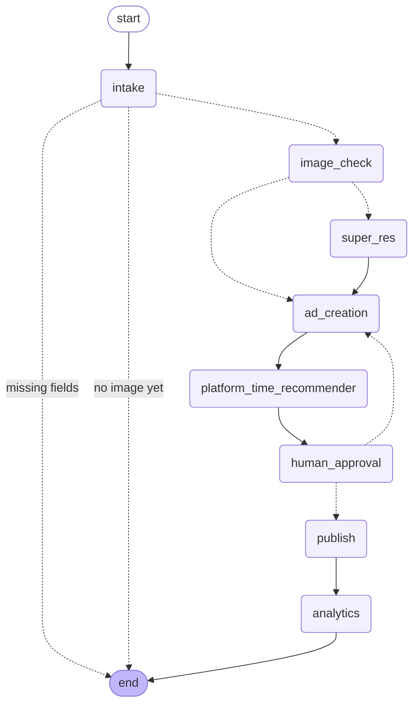

# Marketing Assistant — Workflow Diagram

Rendered directly from the compiled LangGraph graph (`graph.get_graph().draw_mermaid()`),
so this is guaranteed to match the actual code, not a hand-drawn approximation.

## Notes

- **`intake` loops on itself** (via the Streamlit chat loop, not a graph self-edge)
  until `product`, `offer`, `target_audience`, and `campaign_goal` are all filled,
  and until a product image has been uploaded. Each incomplete turn ends the graph
  invocation (`__end__`) so control returns to the manager for their next message.
- **`image_check` → `super_res` is conditional**: only runs when
  `check_image_quality` flags the photo as low-resolution/blurry.
- **`human_approval` is a hard gate.** It calls LangGraph's `interrupt()`, which
  pauses graph execution entirely. The graph cannot reach `publish` on its own —
  it can only be resumed by the Streamlit app sending the manager's decision via
  `Command(resume=...)`. "Changes requested" loops back to `ad_creation`, regenerating
  the caption/ad image before presenting for approval again.
- **`publish` and `analytics` are simulated** (see README § Simulated components).
